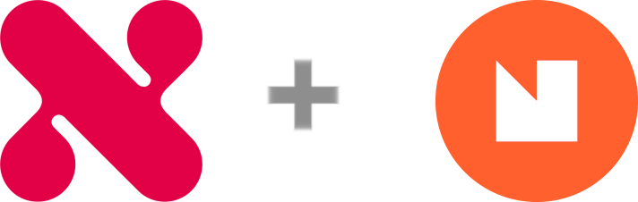

<p align="center">
  <a href="https://www.nettlelabs.com">
    
  </a>
</p>

<h1 align="center">
  NFDomain On-chain Lookup
</h1>

<p align="center">
  Allows the lookup of on-chain NFDomain metadata by address. Can be used by either the client or server to fetch the metadata for a given address.
</p>

### Table of contents

* [1. Installation](#-1-installation)
* [2. Usage](#-2-usage)
* [3. Development](#-3-development)
  * [3.1. Requirements](#31-requirements)
  * [3.2. Setup](#32-setup)
  * [3.3. Build](#33-build)
* [4. Appendix](#-4-appendix)
  * [4.1. Useful Information](#41-useful-information)
* [5. How to Contribute](#-5-how-to-contribute)
* [6. License](#-6-license)
* [7. Credits](#-7-credits)

## 📦 1. Installation

* Using npm:
```shell
$ npm install @Nettle-Labs/nfd-lookup
```

* Using yarn:
```shell
$ yarn add @Nettle-Labs/nfd-lookup
```

## 🪄 2. Usage

```typescript
import { INfdMetadata, lookupNfDomainByAddress } from '@Nettle-Labs/nfd-lookup';
import { Algodv2 } from 'algosdk';

const algodClient: Algodv2 = new Algodv2(
  '',
  'https://testnet-api.algonode.cloud',
  ''
); // first initialize your algod client
const metadata: INfdMetadata | null = await lookupNfDomainByAddress({
  address: 'QSTBDZMDPUHM6LESD54ZUT55KICOECJ4CPOMLAWNMSS3563ZK64HKJ65TM',
  algodClient,
  registryAppId: BigInt('84366825'), // this application ID MUST be the right one for the network
});

if (metadata) {
  console.log(metadata.name); // kieran.algo
}

```

<sup>[Back to top ^][table-of-contents]</sup>

## 🛠 3. Development

### 3.1. Requirements

* Install [Yarn v1.22.5+][yarn]

<sup>[Back to top ^][table-of-contents]</sup>

### 3.2. Setup

1. Install the dependencies:
```bash
$ yarn install
```

<sup>[Back to top ^][table-of-contents]</sup>

### 3.3. Build

* To build simply run:
```bash
$ yarn build
```

This will compile the Typescript source code into a `dist/` directory.

<sup>[Back to top ^][table-of-contents]</sup>

## 📑 4. Appendix

### 4.1 Useful Information

* [Registry Application IDs][registry-application-ids] - the Algorand Application IDs for the NFD registry contract.
* [nfd-cli-examples] - an almost identical Go implementation (it was the template for this repo).

<sup>[Back to top ^][table-of-contents]</sup>

## 👏 5. How to Contribute

Please read the [**Contributing Guide**][contribute] to learn about the development process.

<sup>[Back to top ^][table-of-contents]</sup>

## 📄 6. License

Please refer to the [LICENSE][license] file.

<sup>[Back to top ^][table-of-contents]</sup>

## 🎉 7. Credits

* A massive shout-out to [TxnLab][txn-lab] and the amazing work they are doing for the Algorand ecosystem. ❤️

<sup>[Back to top ^][table-of-contents]</sup>

<!-- Links -->
[contribute]: ./CONTRIBUTING.md
[license]: ./LICENSE
[nfd-cli-examples]: https://github.com/TxnLab/nfd-cli-examples
[registry-application-ids]: https://api-docs.nf.domains/reference/on-chain-reference/registry-application-ids
[table-of-contents]: #table-of-contents
[txn-lab]: https://www.txnlab.dev/
[yarn]: https://yarnpkg.com/
